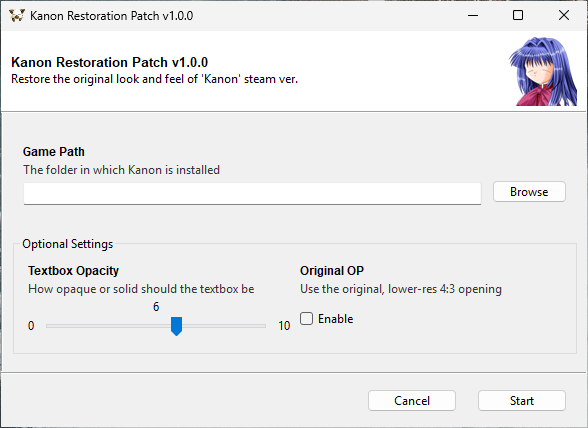
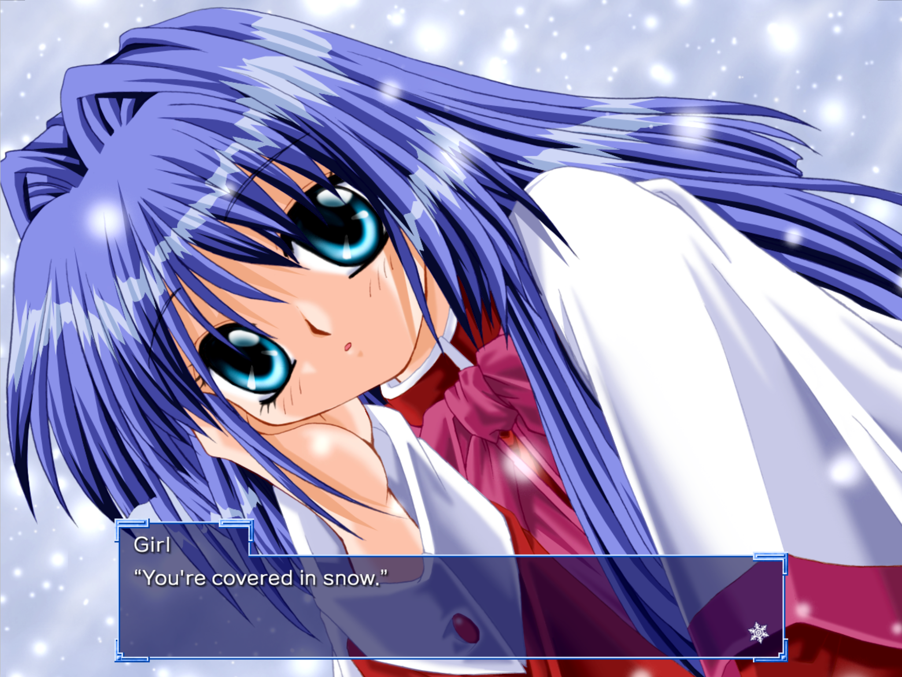
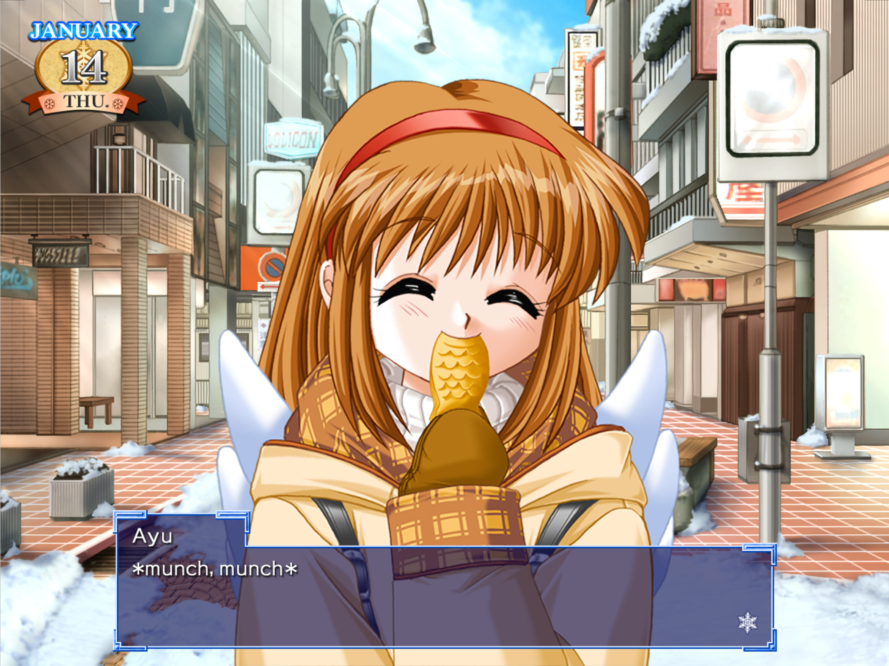
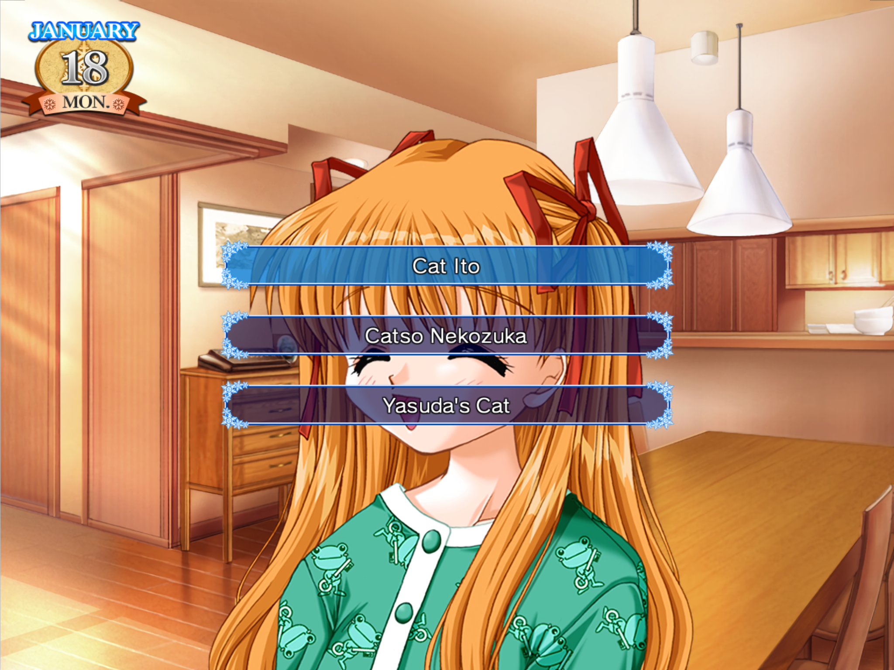
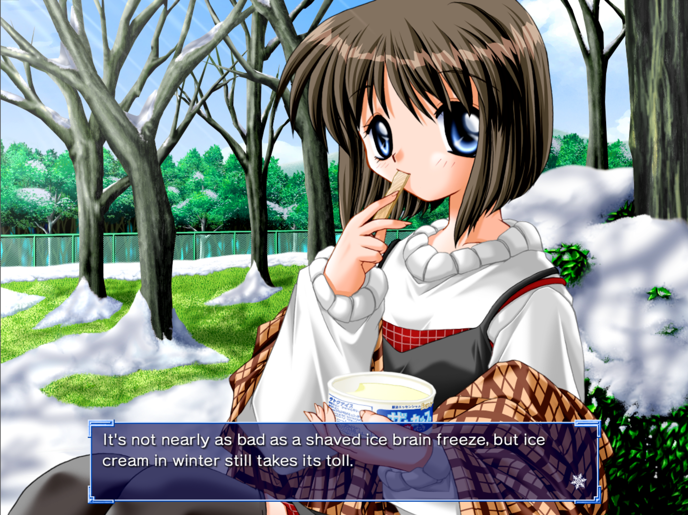

# Kanon Restoration Patch

Restore Kanon's original assets!         

This patch restores Steam's version of Kanon, which is based on the Luca Engine, to how it looked when it originally released. Specifically, this patch changes the aspect ratio from 16:9 to 4:3, revamps the UI to mimic the original and restores the original opening if you so desire. The patch <u>does not</u> add in the H scenes.

## Screenshots

<p align="center">
  <a href="https://raw.githubusercontent.com/Danar435/kanon-restoration/refs/heads/main/assets/installer.png">
    
  </a>
  <a href="https://raw.githubusercontent.com/Danar435/kanon-restoration/refs/heads/main/assets/screenshot-menu.png">
    
  </a>
  <a href="https://raw.githubusercontent.com/Danar435/kanon-restoration/refs/heads/main/assets/screenshot-1.png">
    
  </a>
  <a href="https://raw.githubusercontent.com/Danar435/kanon-restoration/refs/heads/main/assets/screenshot-2.png">
    
  </a>
  <a href="https://raw.githubusercontent.com/Danar435/kanon-restoration/refs/heads/main/assets/screenshot-3.png">
    
  </a>
  <a href="https://raw.githubusercontent.com/Danar435/kanon-restoration/refs/heads/main/assets/screenshot-4.png">
    
  </a>
</p>

## Installing

Download the patch installer corresponding to your operating system from the [releases tab](https://github.com/Danar435/kanon-restoration/releases).

Run the installer and select the game installation directory, which is usually `C:\Program Files (x86)\Steam\steamapps\common\Kanon`. Configure the optional settings and press `Start`! The opacity of the textbox has to be set during the installation, where you can choose between 0% (transparent) and 100% (solid) or anywhere in-between, with 10% increments. In-game, the option "Window Transparency" under "Text1" must be set to "Solid".

The installer should download the source files automatically from GitHub's servers. Make sure that you have at least 1.5 GB of available space on the machine.

If everything goes accordingly, the installer should finish with a SUCCESS message. You can then close it and run Kanon. If you want to change any of the optional settings afterwards, you can just run the installer again. If you are happy with the patch, then you can delete the installer and the leftover assets alongside the installer.

### Uninstalling

If you've installed the patch and want to redownload the original files, right-click the game in Steam, select "Properties", navigate to "Installed Files", and click "Verify integrity of game files". Steam will then redownload all of the files that were replaced.

Another thing you can do is to back up the `files` folder prior to installing the patch to avoid redownloading the original files from Steam. 

### Offline Installation

If you want to use the installer on an offline machine, or if you want to download the assets yourself, then download the `Source Code` from the same release as the installer. Then extract the folder inside and place it in the same directory as the installer.

### Manual Installation

If you don't want to use the installer, you can download the source code and use the tools inside of the `dependencies` folder to manually patch the assets and the executable.

## Building

To build the program, first install [uv](https://github.com/astral-sh/uv), then inside of the project repo, run:

```bash
uv sync
uv run pyinstaller main.spec
```


## Notes

A debug menu has been found. To enable it, add `Hd5aVLTwSitU` as a launch option under "Properties" in Steam. Now you'll have an option to view and change flags from the quick menu in-game. Enabling mouse gestures and swiping up on the "START" button in the main menu opens a different menu that allows you to jump to different seen (scenario) files. Pressing "Esc" in the main menu gives you a (broken) image viewer.

## Special Thanks

- [G2](https://github.com/G2-Games) for [lbee-utils](https://github.com/G2-Games/lbee-utils)
- [WéΤοr](https://github.com/wetor) for [LuckSystem](https://github.com/wetor/LuckSystem) 
- [UGUU](https://github.com/UGUU-Boku-Ayu) for feedback
