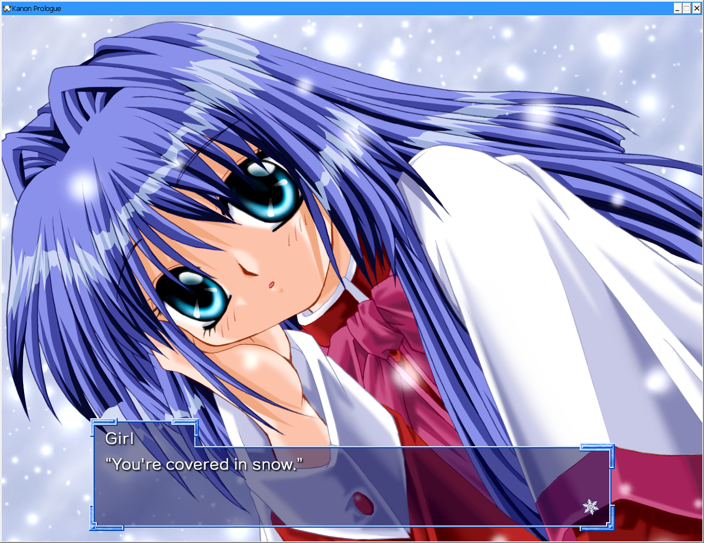
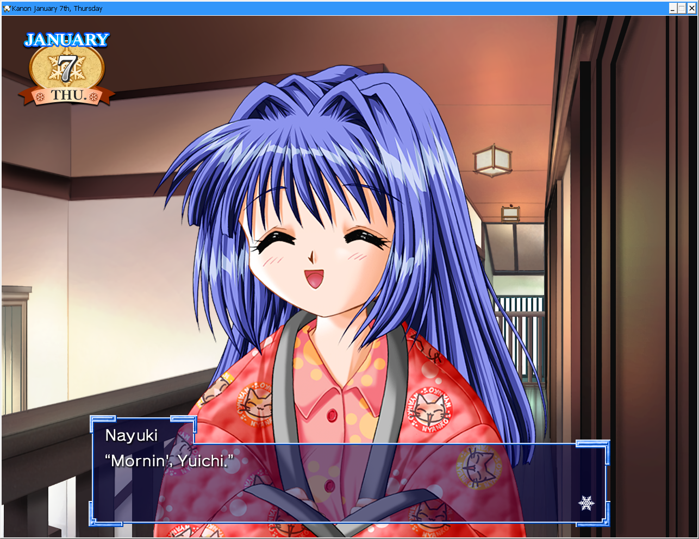

# Kanon Restoration Patch

Restore Kanon's original assets!         

## NOT FINISHED!

This patch is under construction. The progress will be a lot slower compared to the LBEE, as I haven't actually read Kanon yet. So I'll be working on this patch as I go along. Expect things to be broken!

## Screenshots

<p align="center">
  <a href="https://raw.githubusercontent.com/Danar435/kanon-restoration/refs/heads/main/assets/SS1.png">
    
  </a>
  <a href="https://raw.githubusercontent.com/Danar435/kanon-restoration/refs/heads/main/assets/SS2.png">
    
  </a>
</p>

## Installing

No pre-built paks available. Refer to [Building](#building) and [Notes](#notes)

 Copy the contents of `output` to the game installation directory, which is usually in `C:\Program Files (x86)\Steam\steamapps\common\Kanon`. When Windows prompts you about overwriting the files, click "Yes" to proceed. The patch is then installed!

Before installing the patch, consider backing up the `files` folder and `Kanon.exe` file to avoid redownloading the original files in case you want to revert the changes later. If you've already installed the patch and want to redownload the original files, right-click the game in Steam, select "Properties", navigate to "Installed Files", and click "Verify integrity of game files". Steam will then redownload all of the files that were replaced.

## Building

To build the patch on Linux, use the provided bash script. You'll need the [LuckSystem](http://github.com/wetor/LuckSystem/releases/latest/download/LuckSystem_linux_x86_64.zip) binary in the same folder as the script, or alternatively specify its location with `-l`.

To create the patch, run:

```bash
./kanon-repack.sh /path/to/game/folder/
```

The script will repack the files and create an `output` folder containing the patched pak files. Use the xdelta file under `source/auxiliary-files` to patch the executable.

## Notes

A debug menu has been found. To enable it, add `Hd5aVLTwSitU` as a launch option under "Properties" in Steam. Now you'll have an option to view and change flags from the quick menu in-game. Enabling mouse gestures and swiping up on the "START" button in the main menu opens a different menu that allows you to jump to different seen (scenario) files.

## Special Thanks

- [WéΤοr](https://github.com/wetor) for [LuckSystem](https://github.com/wetor/LuckSystem) 
- [G2](https://github.com/G2-Games) for [lbee-utils](https://github.com/G2-Games/lbee-utils)
- [UGUU](https://github.com/UGUU-Boku-Ayu) for input
